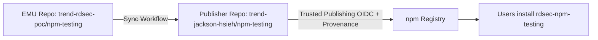

# rdsec-npm-testing

[](https://www.npmjs.com/package/rdsec-npm-testing)
[](https://docs.npmjs.com/generating-provenance-statements)

---

## 📦 About

This repository (`trend-jackson-hsieh/npm-testing`) is the **publishing mirror** for the npm package **[`rdsec-npm-testing`](https://www.npmjs.com/package/rdsec-npm-testing)**.  
It is used **only for Trusted Publishing with provenance**.

👉 **Actual development happens in the EMU GitHub Enterprise repo:**  
[trend-rdsec-poc/npm-testing](https://github.com/trend-rdsec-poc/npm-testing)

---

## 🚀 Installation

```bash
npm install rdsec-npm-testing
```

or with Yarn:

```bash
yarn add rdsec-npm-testing
```

---

## 🔧 Usage

```js
const test = require('rdsec-npm-testing');

console.log(test()); // Example output
```

---

## 🛠 Development Workflow

- All source code, issues, and pull requests are managed in the EMU repo:  
  https://github.com/trend-rdsec-poc/npm-testing

- This repo only receives **synced build artifacts** (e.g., `index.js`, `dist/`, `README.md`) through automation.

### 🔄 Repo Sync & Publish Flow



---

## 🔒 Security & Provenance

This package is published using **npm Trusted Publishing** with **Sigstore provenance**.  
This ensures every release is:

- Built in a short-lived GitHub Actions environment  
- Verified by npm against this repository  
- Immutable and tamper-evident

More details: https://docs.npmjs.com/generating-provenance-statements

---

## 📜 License

[MIT](./LICENSE)

